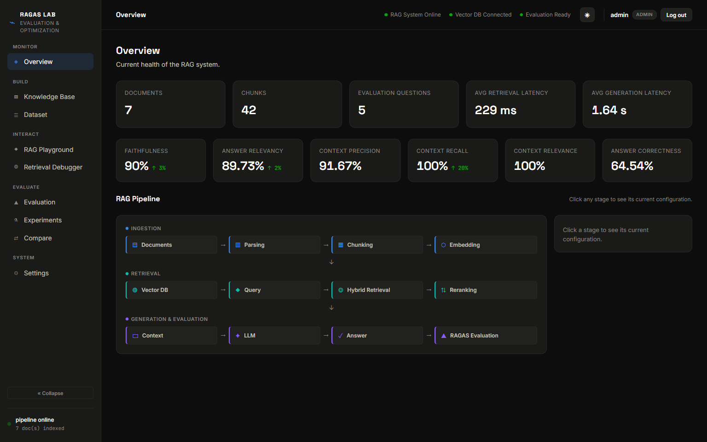
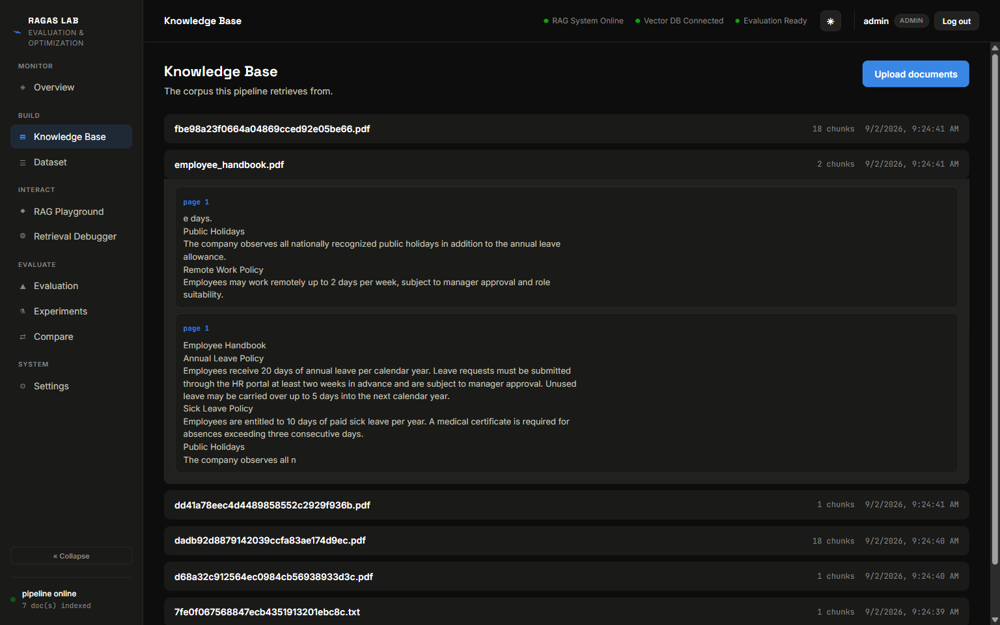
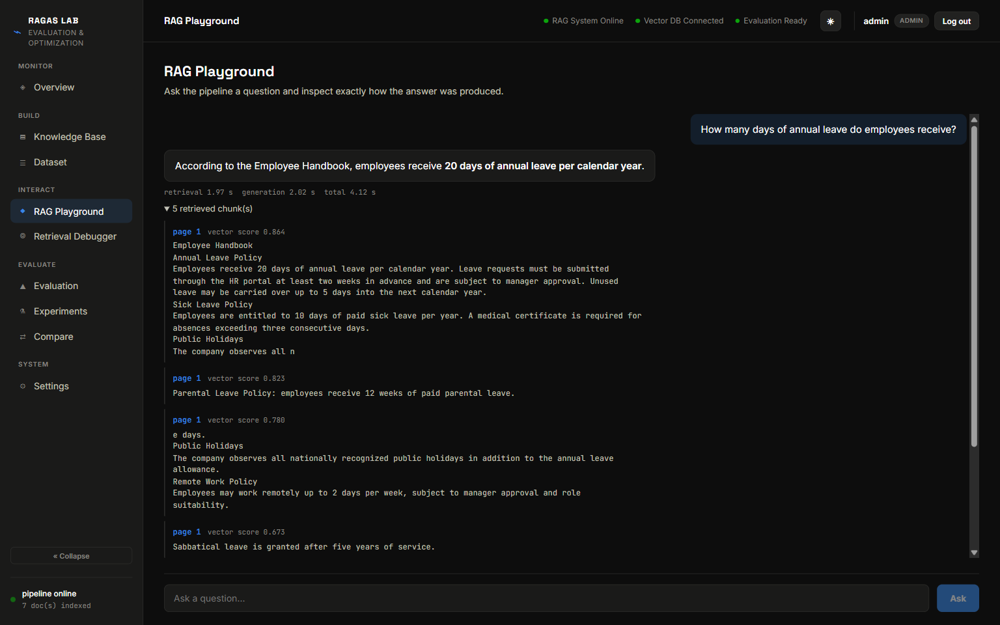
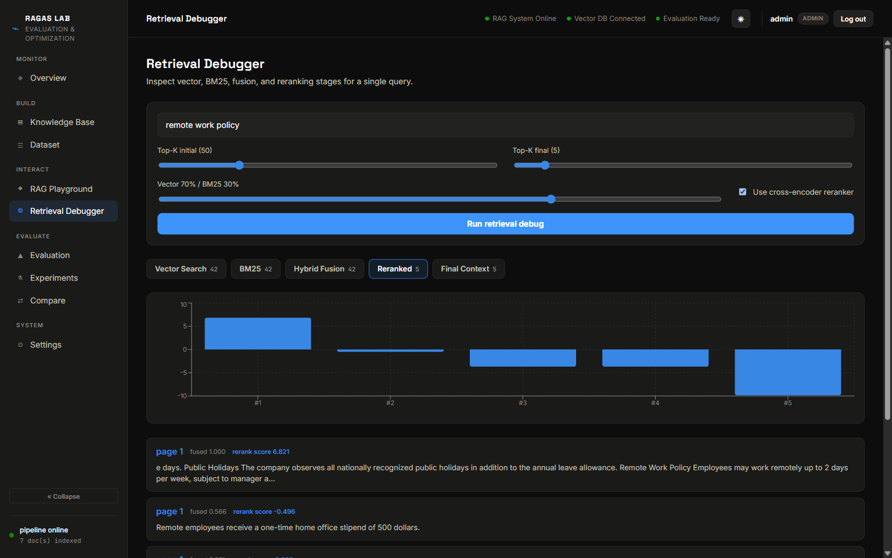
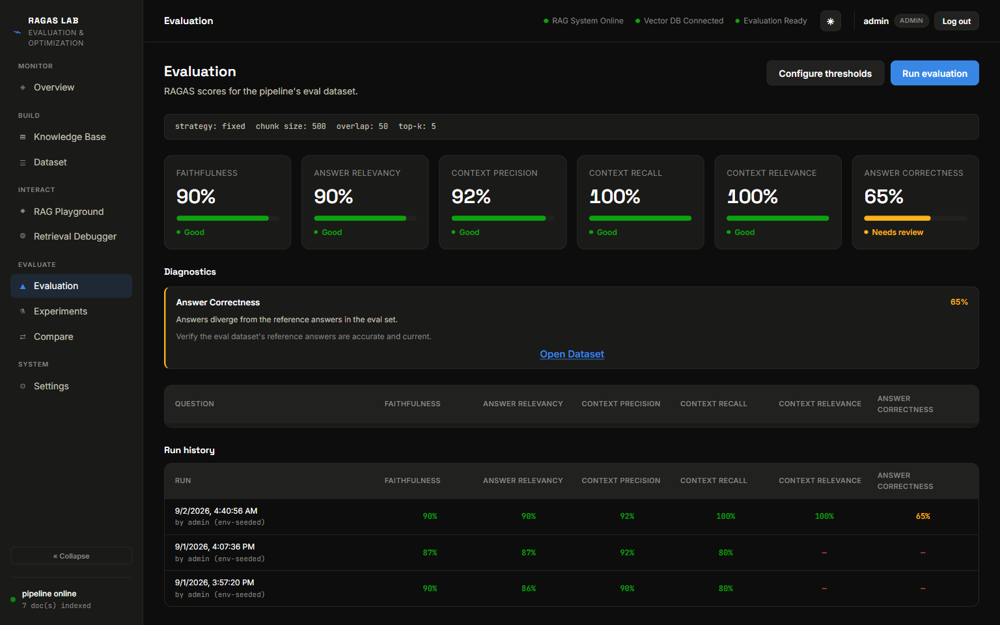
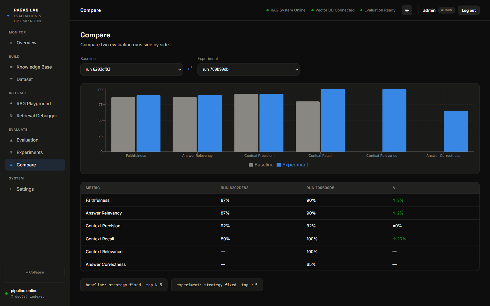

# RAGAS LAB

A self-hosted platform for building, debugging, and evaluating a Retrieval-Augmented Generation pipeline end to end — document ingestion, retrieval tuning, live Q&A, and [RAGAS](https://github.com/explodinggradients/ragas) scoring, all in one app.

[](https://github.com/RithikSDev/Rag_RAGAS/actions/workflows/ci.yml)



## What it does

- **Ingests real documents** — PDF (with OCR fallback for scanned pages and embedded images), PPTX (text, tables, speaker notes, embedded-image OCR), and plain text — chunks and embeds them into a Qdrant vector store.
- **Retrieves with a hybrid pipeline** — dense vector search fused with BM25, plus an optional cross-encoder reranker, all independently tunable (top-k, fusion weight) per query.
- **Answers questions live** through the RAG Playground, showing the generated answer, retrieval/generation timing, and every retrieved chunk with its score.
- **Evaluates against RAGAS** — faithfulness, answer relevancy, context precision, context recall, context relevance, and answer correctness — with per-question breakdowns and run history.
- **Compares runs** side by side to see how a change in chunking strategy, top-k, or reranking moved every metric.
- **Runs multi-user with real auth** — JWT-based login layered on top of API-key auth, with an admin-managed user list.

## Screenshots

**Knowledge Base** — every ingested document with its real extracted chunks.


**RAG Playground** — ask a question, get a sourced answer with timing and ranked retrieved chunks.


**Retrieval Debugger** — inspect vector search, BM25, fusion, and reranking stage by stage for a single query.


**Evaluation** — the six RAGAS metrics, diagnostics on weak scores, and full run history.


**Compare** — two evaluation runs side by side, metric by metric.


## Stack

- **Backend** — FastAPI, SQLAlchemy, Qdrant, sentence-transformers, rank_bm25, RAGAS, Anthropic Claude for generation
- **Frontend** — React 19, Vite, Recharts, Vitest
- **Auth** — JWT (PyJWT + bcrypt) and API keys, unified behind a single principal resolver
- **Parsing** — PyMuPDF (+ Tesseract OCR fallback), python-pptx
- **CI/CD** — GitHub Actions (backend tests, frontend tests/lint/build, Docker image build)

## Running it locally

```bash
git clone https://github.com/RithikSDev/Rag_RAGAS.git
cd Rag_RAGAS
cp .env.example .env   # fill in ANTHROPIC_API_KEY, ADMIN_API_KEY, VIEWER_API_KEY
docker compose up --build
```

- Frontend: http://localhost:8080
- Backend API: http://localhost:8000

A seed document (`data/documents/employee_handbook.pdf`) is bundled so the pipeline has something to index on first boot.

## Tests

```bash
# backend
pip install -r requirements.txt -r requirements-dev.txt
pytest --cov=app --cov=evaluation tests/

# frontend
cd frontend
npm ci
npm run lint && npm run test && npm run build
```
